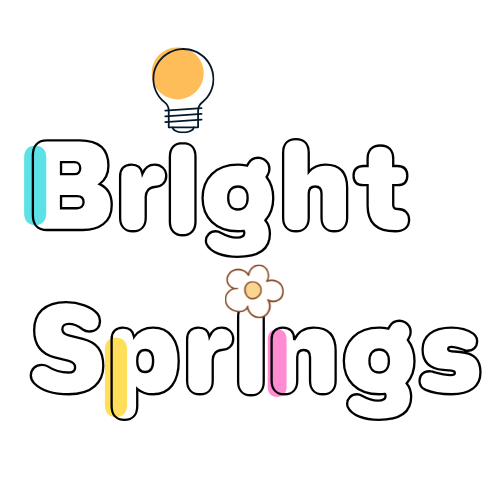
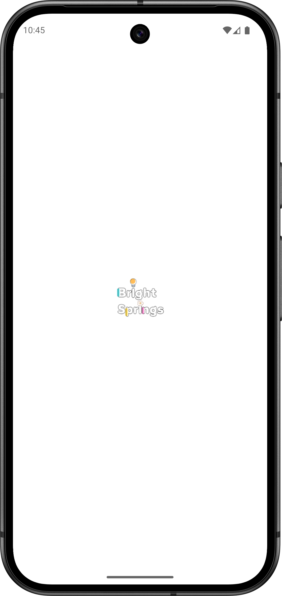
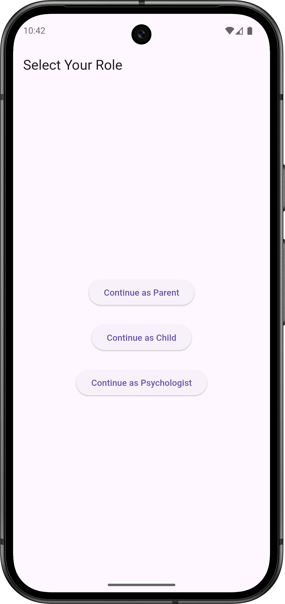
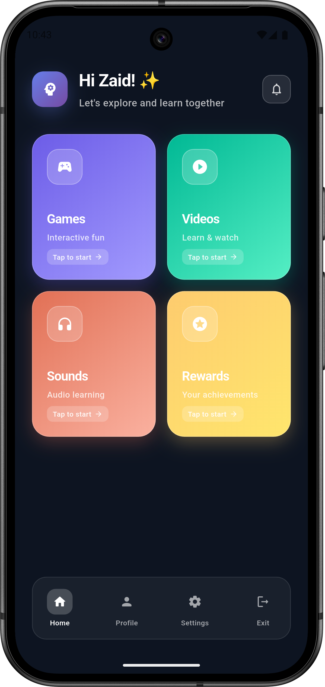
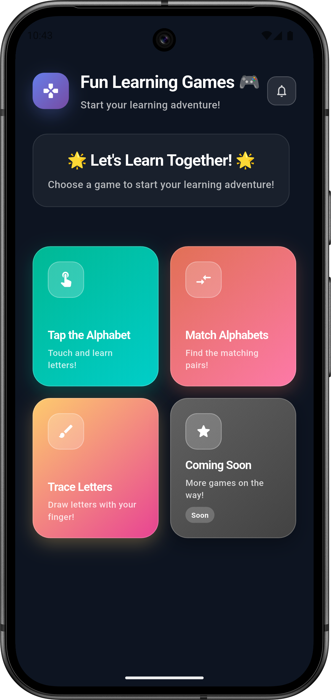
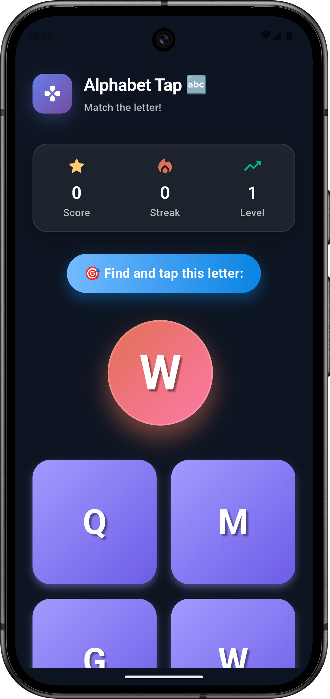
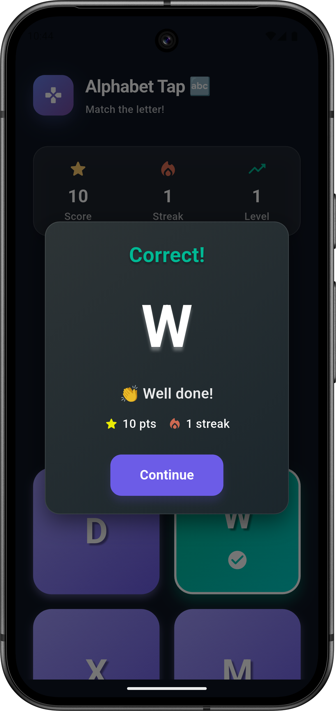
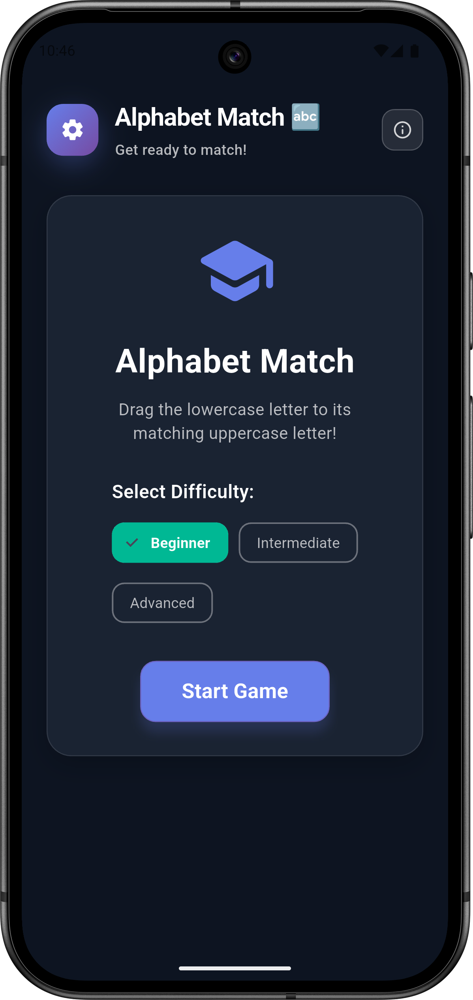
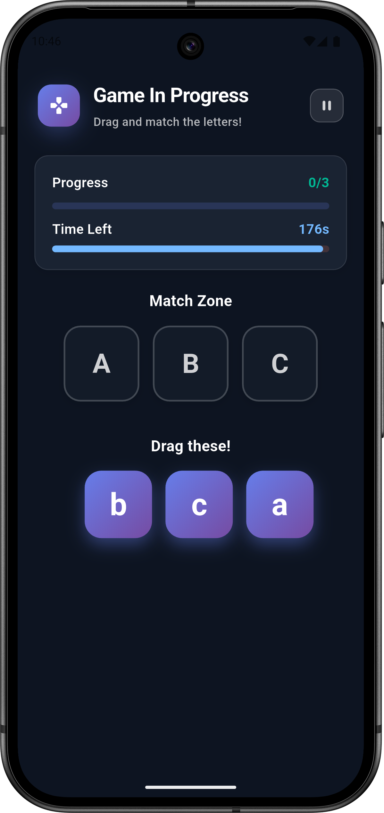

# 🌸 BrightSprings – Child Support App (ASD Assistance)

**Empowering children with Autism Spectrum Disorder (ASD) through technology.**  
BrightSprings is a supportive mobile application designed to provide **interactive tools, structured routines, and emotional support features**.  
It helps children with ASD improve learning, engagement, and daily life management, while giving caregivers powerful tools to monitor progress.

---

## ✨ Features

### 🧠 Personalized Routines
- Custom daily schedules tailored for children with ASD  
- Visual and interactive guidance to support routine-building  

### 🎨 Engaging Activities
- Fun and interactive tasks designed to improve focus and learning  
- Adaptive difficulty to match a child’s growth  

### 📊 Progress Tracking
- Caregivers can monitor a child’s progress  
- Daily and weekly reports with mood and activity summaries  

### 😊 Mood Detection
- AI-driven emotion detection  
- Supports better emotional awareness and caregiver insights  

### 🌐 Accessibility
- Works across platforms (Android/iOS)  
- Cloud backup and sync for families and caregivers  

---

## 📸 Screenshots

### 🌸 App Logo
<p align="center">
   
</p>

### 📱 App Flow
<p align="center">
  
  
  
  
  
  
  
  
</p>

<p align="center">
  <i>More screenshots available in the <code>/screenshots</code> folder (0 → 38)</i>
</p>

---

## 🚀 Quick Start

### Prerequisites
- Node.js 18+  
- Flutter or React Native environment set up  
- Firebase or MongoDB account for database  
- (Optional) API keys for AI-based mood detection  

### Installation

1. Clone the repository:
   ```bash
   git clone https://github.com/your-username/BrightSprings.git
   cd BrightSprings
   ```

2. Install dependencies:
   ```bash
   flutter pub get
   # OR (if React Native)
   npm install
   ```

3. Configure environment variables (`.env` file):
   ```env
   # Firebase / MongoDB
   DB_URI=your_database_url
   FIREBASE_API_KEY=your_firebase_key

   # AI / Cloud
   MOOD_DETECTION_API_KEY=your_ai_key
   ```

4. Run the app:
   ```bash
   flutter run
   # OR
   npm start
   ```

---

## 🛠 Configuration

### Firebase / MongoDB Setup
1. Create a project in Firebase or set up a MongoDB cluster.  
2. Enable **authentication** (email/password for caregivers).  
3. Add your database credentials to `.env`.  

### AI Mood Detection
- Integrate your preferred AI/ML API for emotion detection.  
- Store API key in `.env`.  

---

## 📂 Project Structure

```
BrightSprings/
├── 📁 android/                 # Android-specific code
├── 📁 ios/                     # iOS-specific code
├── 📁 lib/                     # Flutter source code (or src/ for React Native)
│   ├── 📁 components/          # UI components
│   ├── 📁 screens/             # Screens (Dashboard, Activities, Reports, etc.)
│   ├── 📁 services/            # API & database services
│   ├── 📁 models/              # Data models
│   └── main.dart               # App entry point
├── 📁 screenshots/             # App screenshots
├── .env                        # Environment variables
├── .gitignore                  # Git ignore rules
├── README.md                   # Project documentation
└── pubspec.yaml / package.json # Dependencies
```

---

## 📌 Future Plans

- 🤖 AI-powered personalized activity suggestions  
- 🕹️ Gamified tasks for motivation & engagement  
- 🌍 Multi-language support  
- 💬 Parent–caretaker chat module  

---

## 🔒 Security

- `.env` is **ignored** (see `.gitignore`)  
- Sensitive keys are **never committed**  
- All API calls use **HTTPS**  
- Firebase / MongoDB access rules restrict unauthorized access  

---

## 💡 Why BrightSprings?

- **Specially designed** for children with Autism Spectrum Disorder  
- **Caregiver-friendly** tools for monitoring & reports  
- **Interactive & adaptive** for better learning outcomes  
- **Cross-platform** and accessible anywhere  

**BrightSprings is more than an app — it’s a supportive companion for children and their families.** 🌸
